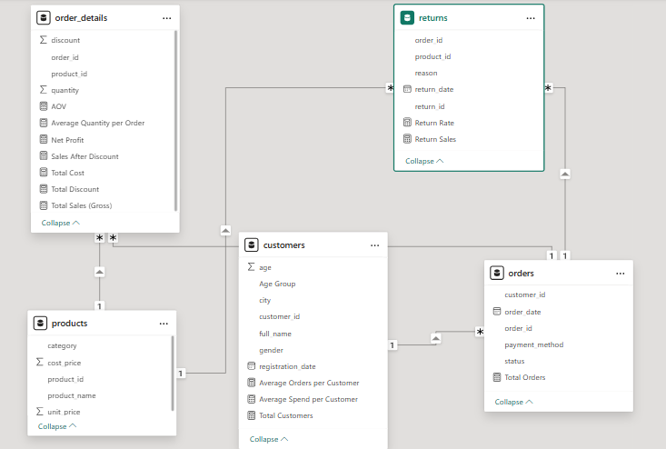
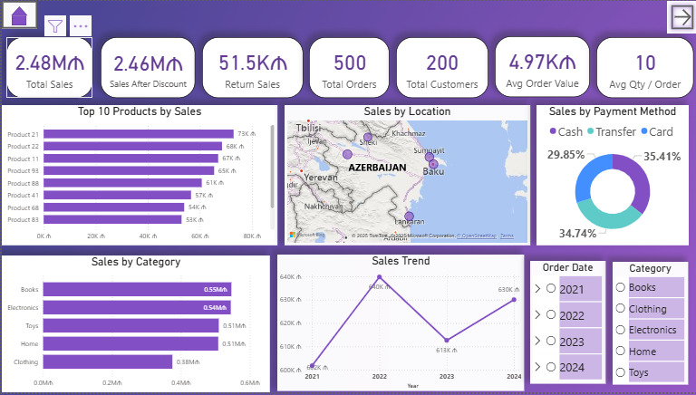
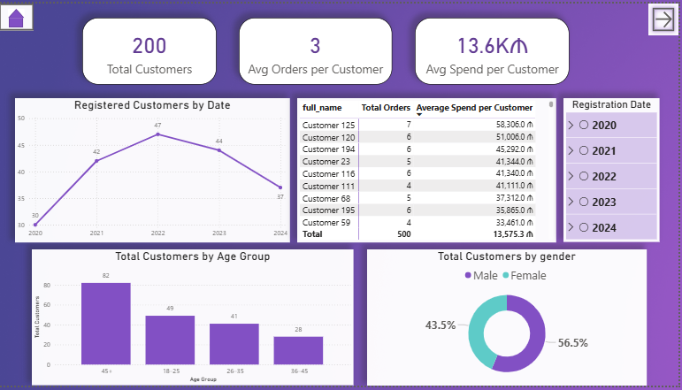
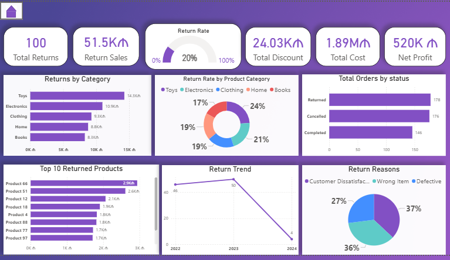

# Retail E-Commerce Sales Analysis — Power BI End-to-End Dashboard

## 📝 Project Overview

This project presents a comprehensive Retail (E-Commerce) Sales Analysis built in Power BI.
The dashboard integrates multiple datasets — customers, products, orders, order details, and returns — to evaluate overall business performance, sales efficiency, customer behavior, product trends, and return patterns.

### [📁 View the Power BI File](files/retail_sales_project.pbix)

## 📊 Dataset Description

## 1. CUSTOMERS
| Column             | Description            |
|--------------------|------------------------|
| customer_id        | Unique customer ID     |
| full_name          | Customer name          |
| gender             | Male/Female            |
| age                | Age                    |
| city               | City                   |
| registration_date  | Registration date      |

---

## 2. PRODUCTS
| Column        | Description         |
|---------------|---------------------|
| product_id    | Product ID          |
| product_name  | Product name        |
| category      | Product category    |
| unit_price    | Selling price       |
| cost_price    | Cost price          |

---

## 3. ORDERS
| Column         | Description               |
|----------------|---------------------------|
| order_id       | Order ID                  |
| customer_id    | Customer ID (FK)          |
| order_date     | Order date                |
| payment_method | Payment method            |
| status         | Completed, Cancelled, Returned |

---

## 4. ORDER_DETAILS
| Column      | Description         |
|-------------|---------------------|
| order_id    | Order ID (FK)       |
| product_id  | Product ID (FK)     |
| quantity    | Quantity            |
| discount    | Discount amount     |

---

## 5. RETURNS
| Column      | Description         |
|-------------|---------------------|
| return_id   | Return ID           |
| order_id    | Order ID (FK)       |
| product_id  | Product ID          |
| return_date | Return date         |
| reason      | Reason for return   |

## 📈 Key Insights
### **1. Sales Overview**

- Total Sales: 2.48M AZN

- Sales After Discounts: 2.46M AZN

- Return Value: 51.5K AZN

- Total Orders: 500

- Total Customers: 200

- Avg products per order: ~10

- Avg order value: 4.97K AZN

- Top 10 customers spend between 48K–73K AZN each.

### Sales by City

- Ganja — 535K

- Baku — 529K

- Sumgait — 500K

- Lankaran — 498K

- Sheki — 420K

### Payment Methods

- Mostly Cash and Bank Transfer

- Card payments only 29.85%

### Sales by Category

**Highest:** Books & Electronics

**Lowest:** Clothing

### Monthly Trends

**Highest sales:** July — 288K

**Lowest sales:** November — 106K

### Yearly Trends

**Lowest:** 2021 — 601K

**Highest:** 2022 — 639K

### 2. Customer Insights

- Total customers: 200

- Avg orders per customer: 3

- Avg customer lifetime value: 13.6K AZN

### Registrations

**Highest:** September — 22

**Lowest:** December — 7

### Age Segmentation

**Largest group:** 45+ (82 customers)

**Smallest group:** 36–45 (28 customers)

### Gender

- 56.5% Male

- 43.5% Female

### Top Customer

Customer 125 → 7 orders, 58,306 AZN spent

### 3. Returns & Performance

- Total Returns: 100

- Return Value: 51.5K AZN

- Return Rate: 20% (high)

- Total Discounts: 24K AZN

- Total Cost: 1.89M AZN

- Net Profit: 520K AZN

### Category with highest returns

- Toys — 14.3K AZN

### Category with lowest returns

- Books — 8.3K AZN

### Status Distribution

- Returned: 178

- Cancelled: 176

- Completed: 146

### Return Reasons

- 37% — Customer Dissatisfaction

- 36% — Wrong Item (2nd most common)

## ✔️ Summary & Recommendations
**Overall Summary**

Sales performance is stable, driven mostly by Ganja and Baku. Customer acquisition is growing steadily, with 45+ being the most active age segment. The major challenge is the 20% return rate, especially in the Toys category.

**Recommendations**

- Improve product quality and descriptions in the Toys category.

- Enhance customer support and quality control processes to minimize dissatisfaction.

- Add a double-check system in the warehouse to prevent Wrong Item issues.

- Launch campaigns to increase card payment adoption.

- Create targeted marketing for 36–45 age group.

- Implement loyalty/membership benefits for top customers.

- Build a seasonal sales calendar based on peak months.

## 🛠️ Tools & Technologies

- Power BI

- Data Modeling (Star Schema)

- DAX Measures

- Data Cleaning & Transformations

- Business Analytics & Visualization